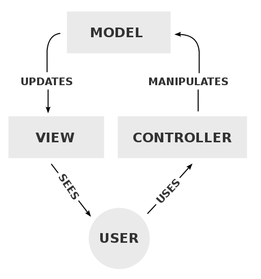

# Rails - Introduction
Rails is an open-source web application framework.  A framework is a set of code libraries, data structures and application guidelines that provide generic functionality.

## Rails Design Principles
Rails main design principles are:

- DRY: Rails provides an architecture that ensures DRY (don't repeat yourself) code.
- Convention over configuration: Rails is very opinionated, thus decreasing developer decisions and at the same time allowing for flexibility. For the most part, it follows best practices that are accepted across the development community.
- MVC architecture: Model-View-Controller (MVC) architecture is widely used architecture that was first introduced in 1979, and has since been used in many development frameworks, including Rails.  More on this later.

## Installing Rails
We can install rails using RubyGems, which is Ruby's default package manager.  Rails is a Ruby gem, which is the name for all Ruby packages (external modules):

```
gem install rails
```

The command above installs the Rails library and all its related modules.

## First Application
To create an application in Rails, we run the `rails new` command followed by the application name.

```
rails new blogger
```

The command above will generate a folder named `blogger`, that contains the following files and folders:

- `app/`          Core application code, including models, views and controllers
- `app/assets`    Applications assets such as CSS, JavaScript files and images
- `bin/`          Binary executable files
- `bin/rails`     Program for generating code, opening console sessions, or starting a local server
- `bin/bundle`    Program to download and install Ruby gem dependencies for this application.
- `bin/rake`      Program to create database migrations and run long running tasks
- `config/`       Application configuration
- `db/`           Database files, schema, migrations
- `doc/`          Documentation for the application
- `lib/`          Library modules
- `lib/assets`    Library assets such as cascading style sheets (CSS), JavaScript files, and images
- `log/`          Application log files
- `public/`       Data accessible to the public (e.g., via web browsers), such as error pages
- `bin/rails`     A program for generating code, opening console sessions, or starting a local server
- `test/`         Application tests
- `tmp/`          Temporary files
- `vendor/`       Third-party code such as plugins
- `vendor/assets`	Third-party assets such as cascading style sheets (CSS), JavaScript files, and images
- `README.md`     A brief description of the application
- `Rakefile`      Utility tasks available via the rake command
- `Gemfile`	      Gem dependencies for this app
- `Gemfile.lock`  A list of gems used to ensure that all copies of the app use the same gem versions
- `config.ru`     A configuration file for Rack middleware
- `.gitignore`    List/pattern of files to exclude from your Git repository.

### Bundler
After installing a new Rails application, the next step is to run Bundler to install the gems needed by the app. When you run `rails new`, it also runs `bundle install`, which does just that.  

Bundler uses the `Gemfile` to decide which packages to install.  The syntax of a `Gemfile` line is as follows:

```Ruby
gem '<gem-name>', '<version>'
```

If a version is not specified, then Bundler will install the latest version of the gem.

There are two ways to specify a gem version range:

```Ruby
gem 'jbuilder', '~> 2.0'
```

The above line, installs the `jbuilder` gem as long as it's newer than `2.0` but not newer than `2.1`.

```Ruby
gem 'bootstrap-sass', '>= 3.3.6'
```

This installs the the latest version of `bootstrap-sass` gem as long as it's greater than `3.3.6`.

Basically, the `>=` notation always install the latest gem and the `~>` will install updated gems representing minor point releases (i.e. `2.0.0` to `2.0.y`) but not major releases (i.e. `2.1.0` to `2.x.y` where `x` >= 1).

### Running the Application
To run the application we simply type: `rails server` or the shorthand `rails s`

This will start the rails server on the default port of 3000.  You can navigate to http://localhost:3000 in your browser to view your application.

Let's learn about Rails architecture before we get deeper into this application.

## MVC Architecture



Model: The model directly manages data, logic and rules of the application.
View: The view dictates the visual representation and the user interaction of the application.
Controller: The controller controls both the models and views.  It receives user commands through the view, works with the model to process the data and then instructs the view to display the data.

### Controller
When a browser sends a request, the web server passes on the request on to the Rails `controller`, which decides what needs to happen next.  In some cases the controller will immediately render a `view`, in others, the `controller` interacts with the `model` to send, receive or process data that is in a database.

Example

```Ruby
class HomeController < ApplicationController
  def index
    render html: 'hello, world!'
  end
end
```

Notice that HomeController is a subclass of the `ApplicationController` superclass, which in turn is a subclass of the `ActionController::Base` superclass, which is part of the Rails gem.  This allows us to reuse methods and attributes that are available in both of those classes in our own custom controllers.

### View
The view is a template that gets converted into HTML and is sent back to the browser.  Rails by default uses the ERB template engine but you can easily plug in your own template engine like HAML.  For the purpose of this course, we'll be using ERB.

Example ERB Template:

```HTML
<div class="large-text">
  <%= @user.name %>
</div>
```

The `<%= %>` notation tells our template to render `@user.name` which is an attribute in the model (class) `@user` which is what the `controller` passes into the `view`.

### Model
Rails uses the Active Record Pattern for its models. The Rails library that implements this pattern is called `ActiveRecord`, it is an Object Relational Mapper (ORM) library, that generates models that map to the database.  `ActiveRecord` also creates methods on these models (which are classes) that can perform Create, Read, Update and Delete (CRUD) operations on database records.

The general flow to create `ActiveRecord` models are:

- Create a migration to create the database table
- Create a class that inherits from `ActiveRecord::Base`

Example:

Migration:
```Ruby
class CreateUsers < ActiveRecord::Migration[5.0]
  def change
    create_table :users do |t|
      t.string :name
      t.integer :age
    end
  end
end
```

Model:
```Ruby
class User < ActiveRecord::Base
  # Rails automatically maps :name and :age in here
end
```

`ActiveRecord` relies heavily on naming to automatically map classes and attributes to database tables and columns.


## Blogging Application
Let's change our application to welcome the user to our new blogging app.

In order to do that, we need to create a controller for the home page of our application:

In terminal:

```
rails g controller Home index
```

Rails will install several files when we do this, but the most important ones are:
- `app/controllers/home_controller.rb`
- `app/views/home/index.html.erb`

Open the `app/views/home/index.html.erb` and replace it with the following single line of HTML:

```HTML
<h1>Hello World!</h1>
```

We now need Rails to use our new action instead of the default page.  

We need to open `config/routes.rb` and add the following route:

```Ruby
Rails.application.routes.draw do
  get 'home#index'

  root 'home#index'
end
```

Note the basic syntax for routes is:

```Ruby
'<method>' 'controller_name#action_name'
```

When a request is made to our web server, the first thing it does is to look up these routes and then it will "route" the request to the appropriate `controller`.

The line `get 'home#index'` was added by the `rails g` command above.  It tells the web server to route any 'GET' requests to the `/home/index` path to the controller we just created.

Note, we can do `rails routes` to see all the routes that are available in our application.

### Resources
Now that we have a basic application, let's look at how we can make it a true blogging application.  In order to do that, we need to identify and create resources.  Resources are collection of similar objects, in a blogging application users, posts and comments are all considered resources.

Rails provides a `resources` method which can be used to declare a standard REST resource. Let's start by adding the `post` resource to  `config/routes.rb` so the file will look as follows:

```Ruby
Rails.application.routes.draw do

  resources :posts

  root 'home#index'
end
```

Now if you type `rails routes`, you will see the new REST based routes created for posts.

### Controllers and Actions
Now that we have our resource routes, we need to create the corresponding controller and actions for those routes.  First, we need place to create new posts.  This in the rails world would be at http://localhost:3000/posts/new, but when we go there, we get an error.

```
uninitialized constant PostsController
```

In order to fix the error, we need to create a controller for `posts`:

```Ruby
rails g controller Posts
```

Let's now check the controller we created, it is going to be in `app/controllers/posts_controller.rb`:

```Ruby
class PostsController < ApplicationController
end
```

Now if you refresh http://localhost:3000/posts/new in the browser, we get a different error:

```
The action 'new' could not be found for PostsController
```

This is because we now need to create a `new` action in our empty controller:

```Ruby
class PostsController < ApplicationController
  def new
  end
end
```

Refreshing http://localhost:3000/posts/new is now going to give us a different error:

```
PostsController#new is missing a template for this request format and variant. request.formats: ["text/html"] request.variant: [] NOTE! For XHR/Ajax or API requests, this action would normally respond with 204 No Content: an empty white screen. Since you're loading it in a web browser, we assume that you expected to actually render a template, not… nothing, so we're showing an error to be extra-clear. If you expect 204 No Content, carry on. That's what you'll get from an XHR or API request. Give it a shot.
```

The simplest way to fix this is to create a corresponding template file for this action. Let's create a new file at app/views/posts/new.html.erb and write this content in it:

```HTML
<h1>New Post</h1>
```

Now if we refresh http://localhost:3000/posts/new, we are going to see the new post page.

### Views and Helpers
The primary form builder for Rails is provided by a helper method called form_for. To use this method, add this code into `app/views/posts/new.html.erb`:

```HTML
<%= form_for :post, url: posts_path do |f| %>
  <p>
    <%= f.label :title %><br>
    <%= f.text_field :title %>
  </p>

  <p>
    <%= f.label :body %><br>
    <%= f.text_area :body %>
  </p>

  <p>
    <%= f.submit %>
  </p>
<% end %>
```

The `:post` symbol indicates the object to use for this form.  The `url:` option is telling our form to use the `posts_path`.  We can see by running `rails routes`, the route and its corresponding `controller#action`.  So knowing that the form makes a `POST` request, we should create the corresponding action:

```Ruby
class PostsController < ApplicationController
  def new
  end

  def create
    render plain: params[:post].inspect
  end
end
```

Notice we added a `render` method in the `create` action.  This method instructs rails to render a string or a template depending on our needs.  Right now, it's rendering simple text so we can inspect our POST parameters.

We need to make the `create` action more useful and also persist our new post in a database.

## Generating Models
Models in Rails use a singular name, and their corresponding database tables use a plural name. Rails provides a generator for creating models, which most Rails developers tend to use when creating new models. To create the new model, run this command in your terminal:

```Ruby
rails generate model Post title:string body:text
```

Rails will create a bunch of files. For now, we're only interested in `app/models/post.rb` and `db/migrate/YYYYMMDDHHMMSS_create_posts.rb`.  The former is the model file and the latter is a migration and is responsible for creating the database structure.  Let's look at the migration first.

### Migrations
So `rails generate model` created a database migration file inside the `db/migrate` directory. Migrations are Ruby classes that are designed to make it simple to create and modify database tables. Rails uses rake commands to run migrations, and it's possible to undo a migration after it's been applied to your database. Migration filenames include a timestamp to ensure that they're processed in the order that they were created.

If you look in the `db/migrate/YYYYMMDDHHMMSS_create_posts.rb` file, here's what you'll find:

```Ruby
class CreatePosts < ActiveRecord::Migration[5.0]
  def change
    create_table :posts do |t|
      t.string :title
      t.text :body

      t.timestamps
    end
  end
end
```

To create this table in the database we run the migration:

```
rails db:migrate
```

### Validations
Generally we want to validate our form fields, in Rails (and other MVC frameworks), we do these validations on the model and in the model file.

In our model file `app/models/post.rb`, we can add the following validations:

```Ruby
class Post < ApplicationRecord
  validates :title, presence: true, length: { minimum: 5 }
  validates :body, presence: true
end
```

With validations in place, we now need to update our controller to handle cases where the post is invalid:

```Ruby
class PostsController < ApplicationController
  def new
    @post = Post.new
  end

  def create
    @post = Post.new(post_params)

    if @post.save
      redirect_to @post
    else
      render :new
    end
  end

  # ...
end
```

Notice that `@post.save` returns `true` or `false` depending on wether the post is valid or invalid.  Also note that if invalid, then we are rendering the `new` action and in turn the form back to the user instead of redirecting. Lastly, notice that the `new` action now creating a new instance variable called `@post`, we'll find out why in a bit.

We need a way to display the error messages back to the user, so in `app/views/posts/new.html.erb`:

```HTML
<h1>New Post</h1>
<%= form_for :post, url: posts_path do |f| %>
  <% if @post.errors.any? %>
    <div>
      <h2>
        Please fix the following errors:
      </h2>
      <ul>
        <% @post.errors.full_messages.each do |msg| %>
          <li><%= msg %></li>
        <% end %>
      </ul>
    </div>
  <% end %>
  <p>
    <%= f.label :title %><br>
    <%= f.text_field :title %>
  </p>

  <p>
    <%= f.label :body %><br>
    <%= f.text_area :body %>
  </p>

  <p>
    <%= f.submit %>
  </p>
<% end %>
```

First, we are checking whether there were any errors with `@post.errors.any?` and if there were then we iterate through `@post.errors.full_messages` and display a list of messages.

Now, the reason we added `@post = Post.new` is that otherwise `@post` in our view would be `nil` and none of the error display code in our `app/views/posts/new.html.erb` would work.

Validations are covered in detail at [Active Record Validations](http://guides.rubyonrails.org/active_record_validations.html)

## More Controller Actions and Views

### Listing
We should now look at adding a way for the user to view a list of posts, to do that, we need to first add an `index` action:

```Ruby
class PostsController < ApplicationController
  def index
    @posts = Post.all
  end

  def new
    @post = Post.new
  end

  def create
    @post = Post.new(post_params)

    if @post.save
      redirect_to @post
    else
      render :new
    end
  end

  def show
    @post = Post.find(params[:id])
  end

  private
    def post_params
      params.require(:post).permit(:title, :body)
    end
end
```

By convention, we add `index` as the first method in the controller.

Now let's add a view for the `index` action at `app/views/posts/index.html.erb`:

```HTML
<h1>Posts</h1>

<table>
  <tr>
    <th>Title</th>
    <th>Body</th>
  </tr>

  <% @posts.each do |post| %>
    <tr>
      <td><%= post.title %></td>
      <td><%= post.body %></td>
      <td><%= link_to 'Show', post_path(post) %></td>
    </tr>
  <% end %>
</table>
```

If we go to http://localhost:3000/posts, we should see a list of all the posts we've created so far.

Notice the `link_to`?  That's a view helper to create links based on paths we pass it in as arguments. Remember that we can figure out what path to use here by doing `rails routes` and then appending `_path` to the `Prefix`, we'd also pass the post as an argument if the `URI Pattern` indicates parameters (denoted with a symbol).

### Updating
We have covered create and reading so far, basically the CR part of CRUD. Let's look at the U part, updating posts:

We first need to show the user a form that they can use to edit a post, so we need add an `edit` action:

```Ruby
def new
  @post = Post.new
end

def edit
  @post = Post.find(params[:id])
end

def create
  @post = Post.new(post_params)

  if @post.save
    redirect_to @post
  else
    render :new
  end
end
```

Note its location in the file, that is by convention.  Just like the `show` action, we need to query the database based on the post's id, which we get from the `:id` parameter in the URL with `params[:id]`.

We then need to add the corresponding view at `app/views/posts/edit.html.erb`:

```HTML
<h1>Edit Post</h1>
<%= form_for :post, url: post_path(@post), method: :patch do |f| %>
  <% if @post.errors.any? %>
    <div>
      <h2>
        Please fix the following errors:
      </h2>
      <ul>
        <% @post.errors.full_messages.each do |msg| %>
          <li><%= msg %></li>
        <% end %>
      </ul>
    </div>
  <% end %>
  <p>
    <%= f.label :title %><br>
    <%= f.text_field :title %>
  </p>

  <p>
    <%= f.label :body %><br>
    <%= f.text_area :body %>
  </p>

  <p>
    <%= f.submit %>
  </p>
<% end %>
```

Similar to our `new` form, with two main differences.  Firstly, we are now using the post update path, which we still need to define an action for, secondly, we have updated our form method to `:patch`, which by REST conventions is the verb we use for partial updates to an object.

Another thing worth noting is that since we are using `:post` as the `form_for` argument, Rails automatically knows to fill in the form with the fields of the `@post` object.  It knows that by name matching so naming is crucial in this case.

Let's put in the `update` action now:

```Ruby
def create
  @post = Post.new(post_params)

  if @post.save
    redirect_to @post
  else
    render :new
  end
end

def update
  @post = Post.find params[:id]

  if @post.update post_params
    redirect_to @post
  else
    render :edit
  end
end
```

This is very similar to `create`, except that we load the post from the database and we call `@post.update` instead of `@post.save`.  One thing to note is that Rails is smart enough to only update fields that were changed and will leave the rest untouched.

### Partials
Since our edit page looks similar to new, we should remove duplication by using a view partial.  By convention, partial files are prefixed with underscore.

Create a new file `app/views/posts/_form.html.erb` with the following content:

```HTML
<%= form_for @post do |f| %>
  <% if @post.errors.any? %>
    <div>
      <h2>
        Please fix the following errors:
      </h2>
      <ul>
        <% @post.errors.full_messages.each do |msg| %>
          <li><%= msg %></li>
        <% end %>
      </ul>
    </div>
  <% end %>
  <p>
    <%= f.label :title %><br>
    <%= f.text_field :title %>
  </p>

  <p>
    <%= f.label :body %><br>
    <%= f.text_area :body %>
  </p>

  <p>
    <%= f.submit %>
  </p>
<% end %>
```

Note that everything except for the `form_for` declaration stayed the same, the reason we can do this is that `@post` is a resource that corresponds to a full set of RESTful routes, and Rails is able to infer which URI and verb to use based on this resource.

Now let's update `app/views/posts/new.html.erb` and `app/views/posts/edit.html.erb` to use this partial:

app/views/posts/new.html.erb
```HTML
<h1>New Post</h1>

<%= render 'form' %>
```

app/views/posts/edit.html.erb
```HTML
<h1>Edit Post</h1>

<%= render 'form' %>
```

`render` is another view helper, and we use it to render partials into views.

### Deleting
We are now going to focus on the D part of CRUD, deleting.  If we look at `rails routes`:

```
DELETE /posts/:id(.:format)      posts#destroy
```

We can see that this maps to the `destroy` action in the the `PostsController`, and it uses the `DELETE` http method/verb so we need to add that:

```Ruby
def destroy
  @post = Post.find(params[:id])
  @post.destroy

  redirect_to posts_path
end
```

All we need to do is find that particular post and then call the `destroy` method on it and then redirect the user to the posts listing page.  We don't have to worry about adding a view here because we are redirecting.

Now back on the listing page, we need to add a link to delete a post so going back to `app/views/posts/index.html.erb`:

```HTML
<h1>Posts</h1>

<table>
  <tr>
    <th>Id</th>
    <th>Title</th>
    <th>Body</th>
  </tr>

  <% @posts.each do |post| %>
    <tr>
      <td><%= post.id %></td>
      <td><%= post.title %></td>
      <td><%= post.body %></td>
      <td><%= link_to 'Show', post_path(post) %></td>
      <td><%= link_to 'Delete', post_path(post),
              method: :delete,
              data: { confirm: 'Are you sure?' } %></td>
    </tr>
  <% end %>
</table>
```

Notice now that we have added two new options to the `link_to` helper, the `method:` option tells `link_to` to use the `DELETE` verb to send our request to the URL and the `data: { confirm: 'Are you sure?' }` options tell rails to show a confirm dialog before deleting the post.

We have now covered all four letters of CRUD.

### Associations
We need comments on our posts so we should add a second model that is associated/related to our `Post` model:

In terminal run:
```
rails generate model Comment commenter:string body:text post:references
```

This will generate a few files, let's look at the model file `app/models/comment.rb` first:

```Ruby
class Comment < ApplicationRecord
  belongs_to :post
end
```

 This is very similar to our `Post` model, except that it has that `belongs_to` line, which sets up Active Record associations.


Let's now look at the migration `db/migrate/YYYYMMDDHHMMSS_create_comments.rb`:

```Ruby
class CreateComments < ActiveRecord::Migration[5.0]
  def change
    create_table :comments do |t|
      t.string :commenter
      t.text :body
      t.references :post, foreign_key: true

      t.timestamps
    end
  end
end
```

The `t.references` line creates an integer column called `post_id`, an index for it, and a foreign key constraint that points to the `id` column of the `posts` table. Go ahead and run the migration:

```
rails db:migrate
```

Rails is smart enough to run only the migrations that have not been run on the database yet so you'll see that only this migration ran.

Back to Active Record associations, they allow you to create relationships between your models.  In the case of comments and posts, the relationships are:

- One post can have many comments.
- Each comment belongs to one post.

This is actually very close syntactically to what Rails uses to define these relations.

In our comment model, Rails generated the relationship for us when indicated `post:references` as an option in our model generation:

```Ruby
class Comment < ApplicationRecord
  belongs_to :post
end
```

We now need to add the first relationship to our `Post` model:

```Ruby
class Post < ApplicationRecord
  has_many :comments

  validates :title, presence: true, length: { minimum: 5 }
  validates :body, presence: true
end
```

These two declarations enable some automatic behavior in Rails. For example, if you have an instance variable `@post` containing an post, you can retrieve all the comments belonging to that post as an array using `@post.comments`.

#### Nested Resources
We now need to add routes for our comments so we can map them to different controller actions, in `config/routes.rb`:

```Ruby
resources :posts do
  resources :comments
end
```

This creates comments as a nested resource in posts.  This is another way to capture the hierarchy between posts and comments.

Running `rails routes` in terminal should now give us our new routes:

```
post_comments     GET    /posts/:post_id/comments(.:format)          comments#index
                  POST   /posts/:post_id/comments(.:format)          comments#create
new_post_comment  GET    /posts/:post_id/comments/new(.:format)      comments#new
edit_post_comment GET    /posts/:post_id/comments/:id/edit(.:format) comments#edit
post_comment      GET    /posts/:post_id/comments/:id(.:format)      comments#show
                  PATCH  /posts/:post_id/comments/:id(.:format)      comments#update
                  PUT    /posts/:post_id/comments/:id(.:format)      comments#update
                  DELETE /posts/:post_id/comments/:id(.:format)      comments#destroy
```

Notice that the URIs now also indicate the hierarchy between posts and comments.  These URIs follow REST best practices.

#### Controllers and Views
Now that we have our new model and routes, let's generate the corresponding controller:

```
rails g controller Comments
```

This again creates a few files, including `app/controllers/comments_controller.rb` which has our `CommentsController` class.  

Since users can comment on an existing post, let's add a form to `app/views/posts/show.html.erb`:

```HTML
<p>
  <strong>Title</strong>
  <%= @post.title %>
</p>
<p>
  <strong>Body</strong>
  <%= @post.body %>
</p>
<h2>Add a comment:</h2>
<%= form_for([@post, @post.comments.build]) do |f| %>
  <p>
    <%= f.label :commenter %><br>
    <%= f.text_field :commenter %>
  </p>
  <p>
    <%= f.label :body %><br>
    <%= f.text_area :body %>
  </p>
  <p>
    <%= f.submit %>
  </p>
<% end %>
```

This adds a form on the post show page that creates a new comment by calling the `CommentsController` `create` action. Note that the `form_for` helper here is using an array, which will build a nested route, in this format `/posts/:id/comments` where `:id` is the id of the current post.

We should now wire up our `create` action:

```Ruby
class CommentsController < ApplicationController
  def create
    @post = Post.find(params[:post_id])
    @comment = @post.comments.create(comment_params)
    redirect_to post_path(@post)
  end

  private
    def comment_params
      params.require(:comment).permit(:commenter, :body)
    end
end
```

There are a few things going on here so let's break them down.  First we need to get an existing post from our database:

```Ruby
@post = Post.find(params[:post_id])
```

Then we need to add the comment to the database as an association:

```Ruby
@comment = @post.comments.create(comment_params)
```  

Now we'll have a comment in our `comments` database table with an `post_id` column that corresponds to the post the user just commented on.

We will also have a `@post.comments` collection that we can use in our view to display all comments, so going back to `app/views/posts/show.html.erb`, we should display the new comment(s) back to the user:

```HTML
<p>
  <strong>Title</strong>
  <%= @post.title %>
</p>
<p>
  <strong>Body</strong>
  <%= @post.body %>
</p>
<h2>Comments</h2>
<% @post.comments.each do |comment| %>
  <p>
    <strong>Commenter:</strong>
    <%= comment.commenter %>
  </p>
  <p>
    <strong>Comment:</strong>
    <%= comment.body %>
  </p>
<% end %>
<h2>Add a comment:</h2>
<%= form_for([@post, @post.comments.build]) do |f| %>
  <p>
    <%= f.label :commenter %><br>
    <%= f.text_field :commenter %>
  </p>
  <p>
    <%= f.label :body %><br>
    <%= f.text_area :body %>
  </p>
  <p>
    <%= f.submit %>
  </p>
<% end %>
```

This file is getting pretty big, so we should use partials to clean it up a bit.  Let's create a partial for displaying comments in `app/views/comments/_comment.html.erb`:

```HTML
<p>
  <strong>Commenter:</strong>
  <%= comment.commenter %>
</p>

<p>
  <strong>Comment:</strong>
  <%= comment.body %>
</p>
```

and one for the comment form in `app/views/comments/_form.html.erb`:

```HTML
<%= form_for([@post, @post.comments.build]) do |f| %>
  <p>
    <%= f.label :commenter %><br>
    <%= f.text_field :commenter %>
  </p>
  <p>
    <%= f.label :body %><br>
    <%= f.text_area :body %>
  </p>
  <p>
    <%= f.submit %>
  </p>
<% end %>
```

And then update `app/views/posts/show.html.erb` and add these partials:

```HTML
<p>
  <strong>Title</strong>
  <%= @post.title %>
</p>
<p>
  <strong>Body</strong>
  <%= @post.body %>
</p>
<h2>Comments</h2>
<%= render @post.comments %>

<h2>Add a comment:</h2>
<%= render 'comments/form' %>
```

Notice that Rails can infer the path of the first partial, it knows that it will be in `comments/_comment.html.erb`.

We should also allow for comments to be deleted, so lets update our first partial to allow for just that:

```HTML
<p>
  <strong>Commenter:</strong>
  <%= comment.commenter %>
</p>

<p>
  <strong>Comment:</strong>
  <%= comment.body %>
</p>
<p>
  <%= link_to 'Destroy Comment', [comment.post, comment],
               method: :delete,
               data: { confirm: 'Are you sure?' } %>
</p>
```

And then update the corresponding controller `app/controllers/comments_controller.rb` to include the `destroy` method:

```Ruby
def destroy
  @post = Post.find(params[:post_id])
  @comment = @post.comments.find(params[:id])
  @comment.destroy
  redirect_to post_path(@post)
end
```

Also, going back to the post, it's also important to delete comments if a post is deleted, we can ensure associated objects are deleted like so:

```Ruby
class Post < ApplicationRecord
  has_many :comments, dependent: :destroy

  validates :title, presence: true, length: { minimum: 5 }
  validates :body, presence: true
end
```

## Basic Authentication
We obviously only want authorized users to create or delete posts or comments.  

The simplest way to do is use Rails' `http_basic_authenticate_with` method:

In `PostsController`, we want to secure everything except for `index` and `show` actions:

```Ruby
class PostsController < ApplicationController
  http_basic_authenticate_with name: "admin", password: "adminpass", except: [:index, :show]

  ...
end
```

In `CommentsController`, we want to secure only the `destroy` action:

```Ruby
class CommentsController < ApplicationController
  http_basic_authenticate_with name: "admin", password: "adminpass", only: :destroy

  def create
    @post = Post.find(params[:post_id])
    @comment = @post.comments.create(comment_params)
    redirect_to post_path(@post)
  end

  private
    def comment_params
      params.require(:comment).permit(:commenter, :body)
    end
end
```
