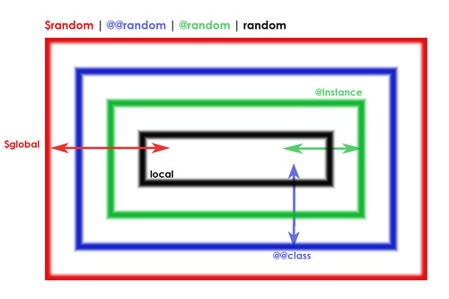

# Ruby
Ruby is an object oriented programming language created in Japan in 1995 by Yukihiro "Matz" Matsumoto. It is an interpreted language, meaning you don't have to run it through another computer program or compiler to come out with an application that you can run.


## Installing Ruby

### Mac
Macs come with a version of Ruby pre-installed.  For the purpose of this course, we want to have the latest version of Ruby installed.

The best way to install the latest Ruby version and manage different Ruby versions is [rbenv](https://github.com/rbenv/rbenv).  The simplest way to install `rbenv` is to use [Homebrew](http://brew.sh/), which is the leading package manager for Mac.  You will most likely be using Homebrew to install many different packages and programs going forward.

First we need to install Homebrew:

```bash
/usr/bin/ruby -e "$(curl -fsSL https://raw.githubusercontent.com/Homebrew/install/master/install)"
```

Then we can install `rbenv`

```bash
brew install rbenv
```

Note that you may need to update your `~/.bash_profile` to include the following lines:

```bash
export PATH="$HOME/.rbenv/bin:$PATH"
eval "$(rbenv init -)"
```

Once `rbenv` is installed, we will need to install the latest Ruby version:

```bash
rbenv install 2.3.1
```

After installation is complete, set your global Ruby version to the latest:

```bash
rbenv global 2.3.1
```

Now to make sure it worked, we need to check the Ruby version:

```bash
ruby -v    # should print out the latest Ruby version
```

### Windows
You can install Ruby on Windows using [RubyInstaller](http://rubyinstaller.org/). This will install the latest version of Ruby on your machine.

## Using Ruby
There are three ways to use Ruby:

- Single command
- Ruby file
- Interactive Ruby Shell (IRB)

### Single command
You can run a single Ruby command using CLI:

```bash
ruby -e "puts 'hello'"
```

This is a good way to quickly test single line commands.

### Ruby File
Another way to run Ruby is through a Ruby file.  All you need to do here is a create a file with a `.rb` extension and then execute it using the `ruby` command:

```bash
echo "puts 'hello'" > hello.rb
ruby hello.rb
```

### Interactive Ruby Shell (IRB)
Interactive Ruby Shell (IRB) is a command line to Ruby.  It allows us to interact with our code in real time and it is great for testing your code.  It is a program that is installed when we install Ruby.

To run IRB:
```bash
irb
```

Let's try some commands:

```bash
>> 1 + 1
=> 2
>>puts 'hello'
hello
=> nil
```

Notice that `puts 'hello'` displayed `hello` and `=> nil`.  The `nil` is the return value for `puts`, which is a function to print things to Ruby console, much like `console.log()` in JavaScript.

Note that just like CLI, can use the up and down arrow to go through your command history.

To exit `irb`, just type `quit`.

## Ruby Object Types

### Objects
In Ruby, everything is an object.  This includes strings, integers and all the other types that are generally known as primitives in other languages. An object in Ruby, is an instance of a `class`, which we will talk about later.

### Variables
Variables are used to store objects.  They themselves aren't objects, but they "point" to objects. In Ruby, the convention for variable naming is all lower case and multiword variables are separated by `_`.

Examples
```bash
a = 1
my_variable = 'hello'
```

In Ruby, you can also prepend a variable with certain characters to indicate their scope:

- no prefix: indicates local or block variable
- $: indicates the variable is global
- @@: indicates the variable is class variable
- @: indicates an instance variable.

We will discuss scopes later, but for now, keep these conventions in mind.

### Integers
Integers are objects that represent whole numbers (numbers without decimals).  Integers in Ruby actually have two subclasses:

- Fixnum
- Bignum

We don't really have to worry about these as Ruby handles the subclasses of numbers automatically.  The main difference between these two subclasses are how Ruby stores these in memory.

Note that you can find a class of an object by using `.class`:

```bash
>> 1.class
=> Fixnum
>> 123456789123456789.class
=> Bignum
```

### Floats
Floats are object that represent decimal numbers.  You can perform math operations on floats just like you would with integers.

Since floats are objects, we can perform operations on them using the dot notation.  Let's try out some important float operations:

Get the type of float
```bash
>> 1.5.class
=> Float
```

Round the float up and down accordingly:
```bash
>> 1.5.round
=> 2
```

Round the float down:
```bash
>> 1.5.floor
=> 1
```

Round the float up:
```bash
>> 1.5.ceil
=> 2
```

Convert float to integer
```bash
>> 1.5.to_i
=> 1
```

### Strings
Strings are objects that are sequences of characters. We use single quotes or double quotes to indicate the start and end of a string:

Syntax
```bash
>> "hello"
=> "hello"
```

In Ruby, you can perform summation and multiplication on strings:
```bash
>> "hello" + " " + "world"
=> "hello world"
>> "hello" * 3
=> "hellohellohello"
```

Another thing you can do with string is Ruby evaluations:
```bash
>> hello = "hello"
=> "hello"
>> world = "world"
=> "world"
>> hello_world = "#{hello} #{world}"
=> "hello world"
```

And since they are objects, we can also perform certain operations on them using dot notation:

```bash
>> "Hello".reverse
=> "olleH"
>> "hello".capitalize
=> "Hello"
>> "hello".upcase
=> "HELLO"
>> "HELLO".downcase
=> "hello"
>> "hello".length
=> 5
```

You can also chain string methods:

```bash
>> "hello".upcase.reverse
=> "OLLEH"
```

### Arrays
Arrays in Ruby are also object types.  They are an ordered collection of objects, that can be access via an integer-index.

Syntax
```bash
>> int_array = [1, 2, 3, 4]
>> string_array = ["hello", "world", "!"]
```

You can also access array elements by indexes:
```bash
>> int_array[1]
=> 2
>> string_array[2]
=> "!"
```

You can also append an object to an array:

```bash
>> int_array << 5
=> [1, 2, 3, 4, 5]
```

### Symbols
Symbols are labels used to identify a piece of data.  They are only stored in memory one time, so they are very efficient to use in hashes as object indexes instead of strings.

Syntax
```bash
>> :prop
```

Symbols vs Strings
```bash
>> "prop".object_id
=> 70237575849360
>> :prop.object_id
=> 1144668
>> "prop".object_id
=> 70237575822560
>> :prop.object_id
=> 1144668
```

Note that the `object_id` is different for the same string but not the symbol. `object_id` returns the unique id assigned by Ruby for a certain object.

### Hashes
Hashes are unordered collection of objects that are object-indexed.

Syntax

String indexed
```
>> person = { "name" => "Jim Doe", "age" => 21 }
```

You can then access each value by its corresponding string index:
```
>> person["name"]
```

Symbol indexed
```
>> person = { :name => "Jim Doe", :age => 21 }
>> person = { name: "Jim Doe", age: 21 }      # shorthand version
```

You can then access each value by its corresponding symbol index:
```
>> person[:name]
```

### Booleans
Booleans in Ruby consist of two objects: `true` and `false`.  

We use comparison operators to compare operands and returns a logical value based on whether the comparison is equal to the `true` object.

<table>
 <thead>
  <tr>
   <th>Operator</th>
   <th>Description</th>
   <th>Examples returning true</th>
  </tr>
 </thead>
 <tbody>
  <tr>
   <td>Equal (<code>==</code>)</td>
   <td>Returns true if the operands are equal.</td>
   <td><code>3 == var1</code>
    <p><code>"3" == var1</code></p>
    <code>3 == '3'</code></td>
  </tr>
  <tr>
   <td>Not equal (<code>!=</code>)</td>
   <td>Returns true if the operands are not equal.</td>
   <td><code>var1 != 4<br>
    var2 != "3"</code></td>
  </tr>
  <tr>
   <td>Greater than (<code>&gt;</code>)</td>
   <td>Returns true if the left operand is greater than the right operand.</td>
   <td><code>var2 &gt; var1<br>
    "12" &gt; 2</code></td>
  </tr>
  <tr>
   <td>Greater than or equal (<code>&gt;=</code>)</td>
   <td>Returns true if the left operand is greater than or equal to the right operand.</td>
   <td><code>var2 &gt;= var1<br>
    var1 &gt;= 3</code></td>
  </tr>
  <tr>
   <td>Less than (<code>&lt;</code>)</td>
   <td>Returns true if the left operand is less than the right operand.</td>
   <td><code>var1 &lt; var2<br>
    "2" &lt; 12</code></td>
  </tr>
  <tr>
   <td>Less than or equal (<code>&lt;=</code>)</td>
   <td>Returns true if the left operand is less than or equal to the right operand.</td>
   <td><code>var1 &lt;= var2<br>
    var2 &lt;= 5</code></td>
  </tr>
 </tbody>
</table>

We can also use logical operators on booleans to combine and evaluate multiple comparison operators or Booleans:

<table class="fullwidth-table">
 <thead>
  <tr>
   <th>Operator</th>
   <th>Usage</th>
   <th>Description</th>
  </tr>
 </thead>
 <tbody>
  <tr>
   <td>Logical AND (<code>&amp;&amp;</code>)</td>
   <td><code>expr1 &amp;&amp; expr2</code></td>
   <td>Returns <code>expr1</code> if it can be converted to <code>false</code>; otherwise, returns <code>expr2</code>. Thus, when used with Boolean values, <code>&amp;&amp;</code> returns <code>true</code> if both operands are true; otherwise, returns <code>false</code>.</td>
  </tr>
  <tr>
   <td>Logical OR (<code>||</code>)</td>
   <td><code>expr1 || expr2</code></td>
   <td>Returns <code>expr1</code> if it can be converted to <code>true</code>; otherwise, returns <code>expr2</code>. Thus, when used with Boolean values, <code>||</code> returns <code>true</code> if either operand is true; if both are false, returns <code>false</code>.</td>
  </tr>
  <tr>
   <td>Logical NOT (<code>!</code>)</td>
   <td><code>!expr</code></td>
   <td>Returns <code>false</code> if its single operand can be converted to <code>true</code>; otherwise, returns <code>true</code>.</td>
  </tr>
 </tbody>
</table>

## Conditional Statements/Expression
A conditional statement is a set of commands that execute if a specified condition is `true`. Ruby supports three conditional statements: `if...else...elsif`, `unless...else` and `case...when`.

### `if...else..elsif`
The `if` statement is executed when a logical condition is `true`, and `else` is executed if the logical condition is `false`.

```Ruby
if condition
  # Execute code when condition is true
else
  # Execute code when condition is false
end
```

You can also compound the statements using `elsif` to have multiple conditions tested in sequence:

```Ruby
if condition
  # Execute code when first condition is true
elsif another-condition
  # Execute if second condition is true
else
  # Execute code when neither of conditions above are true
end
```

Example

```Ruby
hour = 15
if hour < 12
  puts "Good Morning"
elsif hour > 12 && hour < 17
  puts "Good Afternoon"
else
  puts "Good Evening"
end
```

### `unless...else`
The `unless` statement is executed when a logical condition is `false`, and `else` is executed if the logical condition is `true`.

```Ruby
unless condition
  # Execute code when condition is false
else
  # Execute code when condition is true
end
```

### `case...when`
A `case...when` statement is similar to `if...else...elsif` statement.  Unlike `switch` in JavaScript, you can use comparison operators on the variable you're comparing.

```Ruby
hour = 15

case
when hour < 12
  puts "Good Morning"
when hour > 12 && hour < 17
  puts "Good Afternoon"
else
  puts "Good Evening"
end
```

### Conditionals as expressions
In Ruby, you can use conditionals as expressions, for example:

```Ruby
hour = 15

message = case
when hour < 12
  "Good Morning"
when hour > 12 && hour < 17
  "Good Afternoon"
else
  "Good Evening"
end

puts message
```

```Ruby
hour = 15

message = if hour < 12
  "Good Morning"
elsif hour > 12 && hour < 17
  "Good Afternoon"
else
  "Good Evening"
end

puts message
```

### `if` and `unless` as Modifiers
You can also use `if` and `unless` as modifiers:

```Ruby
puts "making coffee" if customer.would_like_coffee
puts "servicing engine" unless engine_on
```

## Loops and Iteration
Loops let programs execute statements repeatedly.  They are useful if you are trying to execute statements with different values or walk through an array of objects to look for a particular value.

### While Loop
A `while` loop will continue to execute until the condition is false.

Syntax
```Ruby
while condition
  # execute code
end
```

Example
```Ruby
arr = ["a", "b", "c", "d"]
i = 0

while arr[i]
    puts arr[i]
    i += 1
end
```

This will continue iterating until `arr[i]` evaluates to false, this will happen when `i` is out of the range of the array index.

You can also use `while` as a modifier:

```Ruby
puts arr[i += 1] while arr[i]
```

### Until Loop
An `until` loop is opposite of `while`, it will continue to execute until the condition is true.

Syntax
```Ruby
until condition
  # execute code
end
```

Example
```Ruby
time = 4

until time == 0
  puts time
  time -= 1
end
```

You can also use `until` as a modifier:

```Ruby
puts time -= 1 until time == 0
```

### For Loop
A `for` loop in Ruby is not the same as other languages. It iterates through all the available items in an array or hash.

Syntax
```Ruby
for variable in expression [do]
  # execute code
end
```

Array example
```Ruby
cars = ["Ferrari", "Lamborghini", "Aston Martin"]

for car in cars
  puts car
end
```

To get the index
```Ruby
cars = ["Ferrari", "Lamborghini", "Aston Martin"]

for car in cars do i
  puts "#{car} is at index #{i}"
end
```

Hash example
```Ruby
person = { name: "Jim Doe", age: 21 }

for key, val in person
    puts "#{key} is #{val}"
end
```

## Exercises: Arrays, Hashes, Conditionals and Loops
- Create a `exercise-1.rb` file using Atom
- Create an array of 5 car hashes containing make, model and color keys. Make sure one is color `red`  
- Search for the car that has a color `red`.
- Search for a car or car(s) that contains the letter `i` in its make. Hint: use http://ruby-doc.org as reference.
- Print out the car make and model for each car using two ways to concatenate strings.
- Print to console a string of all car makes separated by `|`.

## Iterators
Iterators are methods that traverse through the elements of an object collection.  The real difference between loops and iterators, other than syntax, is that we don't have to worry about a terminating condition.

Let's look at some iterator examples to get familiar with their concept:

Print hello 5 times
```Ruby
5.times do
  puts "hello"
end
```

Here's another way to do the same thing:
```Ruby
1.upto 5 do
  puts "hello"
end
```

And another:
```Ruby
5.downto 1 do
  puts "hello"
end
```

One of the more popular iterators is the `each` iterator:

```Ruby
cars = ["Ferrari", "Lamborghini", "Aston Martin"]

cars.each do |car|
  puts car
end
```

The variable between the `|` is called the **block parameter**, in this case, its value is string object (car name) in the `cars` array.

## Controls in Loops and Iterators
Ruby allows us to use controls on our loops.  Ruby has four control structures for loops and Iterators

- `break`: terminates the whole loop.
- `next`: jumps to the next loop.
- `redo`: redos the current loop.
- `retry`: tries the whole loop over again.

There is a fourth type of loop in Ruby which is `loop do`, which is the equivalent of `while(true)`.  We'll use `loop do` to illustrate loop controls here but know that these control structures apply to all loops and iterators in Ruby.

For now, let's look at the most commonly used controls `break` and `next`.

### `break`

Ruby code:
```Ruby
i = 0

loop do
  i += 2
  break if i >= 12
  puts i
end
```

Result:
```
2
4
6
8
10
=> nil
```

### `next`

Ruby code:
```Ruby
i = 0

loop do
  i += 2
  break if i >= 12
  next if i == 4
  puts i
end
```

Result:
```
2
6
8
10
=> nil
```

## Code Blocks
Code blocks are a way to group statements.  There are two ways to use code blocks in Ruby:

- `do...end`: used for multiline code blocks.
- `{}`: shorthand notation, good for short statements or single lines of code.

### `do...end`
Again, this is ideal for grouping multiple statements.

```Ruby
1.upto 5 do
  puts "hello"
end
```

### `{}`
Ideal for single line statements.

```Ruby
1.upto 5 { puts "hello" }
```

### Block variables
A block variable is a variable that is made available in a particular block. The variable's scope is local to the block and is not available outside of the block.

```Ruby
1.upto 5 do |i|
  puts i
end
```

In the code above, each number in the dataset 1 to 5 is **yielded** to the `i` variable and is available in the code block.  

### Common Methods Using Code blocks
Ruby has many different methods that use code blocks.  Let's look at some of the more common ones.

Some of these methods take a code block that is a Boolean expression, so it is common to use the shorthand `{}` notation for them.  

Note that unless otherwise noted, these methods apply to both Hashes and Arrays.

### `find`
Returns the first object for which the given block returns `true`.

```Ruby
cars = ["Ferrari", "Lamborghini", "Aston Martin"]

cars.find { |car| car.include? 'n' }

=> "Lamborghini"    # note that this is a single string
```

Note that `find` and `detect` are two names for the same method.

### `select`
Returns an array of objects for which the given block returns `true`.

```Ruby
cars = ["Ferrari", "Lamborghini", "Aston Martin"]

cars.select { |car| car.include? 'n' }

=> ["Lamborghini", "Aston Martin"]  # note that this is an array of strings
```

Note that `select` and `find_all` are two names for the same method.

### `any?`
Returns `true` if the block ever returns a value other than `false` or `nil`.

```Ruby
cars = ["Ferrari", "Lamborghini", "Aston Martin"]

cars.any? { |car| car.include? 'n' }

=> true  
```

Note, it is Ruby's convention to use a `?` at the end of any method that returns a Boolean value.

### `all?`
Returns `true` if the block never returns `false` or `nil`.

```Ruby
cars = ["Ferrari", "Lamborghini", "Aston Martin"]

cars.all? { |car| car.include? 'n' }

=> false  
```

### `map`
Invokes the given code block for each element in collection.

```Ruby
cars = ["Ferrari", "Lamborghini", "Aston Martin"]

cars.map { |car| car + ' is awesome!' }

=> ["Ferrari is awesome!", "Lamborghini is awesome!", "Aston Martin is awesome!"]  
```

Note that `map` and `collect` are two names for the same method.

## Methods
Methods are a block of code defined to perform a particular task.  In Ruby, there is no distinction between methods and functions, because everything is an object.  Even when you define a "function", it is actually a method that is attached to `Object`, which is the default root of all Ruby objects.

### Declaration and Invocation
Methods in Ruby are declared as followed:

Syntax
```Ruby
def <identifier> <parameter1>, <parameter2>,...
  # code to be executed
end
```

Example
```Ruby
def car_exists? car_name  
  ["Ferrari", "Lamborghini", "Aston Martin"].any? { |car| car == car_name }
end
```

A method can be invoked like so:
```Ruby
car_exists? "Lamborghini"
```

Note that `()` can be used in Ruby but are optional.

### Return Values
In Ruby, the last operation is returned from the method automatically.  You can however use the `return` keyword for an early return.

Examples

No return keyword indicated
```Ruby
def car_exists? car_name  
  ["Ferrari", "Lamborghini", "Aston Martin"].any? { |car| car == car_name } # result of this statement is returned automatically
end
```

Early return
```Ruby
def bogus_car_exists? car_name
  if car_name == "Wildcard"
    return true         # returns true if car_name is Wildcard
  end

  ["Ferrari", "Lamborghini", "Aston Martin"].any? { |car| car == car_name }
end
```

### Variable Scope
- Global variable `$variable`: Available everywhere within your Ruby script.
- Instance variable `@variable`: Available only within a specific object, across all methods in a class instance.
- Local variable `variable`: If in method, then only available in method and any code blocks in method.
- Class variable `@@variable`: Available from the class definition and any sub-classes. More on this later.

Here's an visualization of the scope in Ruby:



## Exercises: Iterators, Code Blocks and Methods
- Create an `exercise-2.rb` file using Atom
- Create an array of 5 car hashes containing make, model and color keys. Make sure one is color `red`. Also make sure this array is declared only once.
- Using anything but loops:
  - Define a method that returns car(s) that contain the letter `i` or the letter `a` or the letter `e` in their make.
  - Define another method that prints out an array of strings that contain the car makes, models and colors separated by `|`, i.e. `["make|model|color",...]`. This should only print cars that the above method returned.  Make sure you do not repeat code that you have already written (keep it DRY).

## Classes
Classes define objects, they are basically a template or blueprint for objects.  They are the back bone for object oriented programming.

This will allow us to define our own types with behaviors we can use across the board.

### Class Definitions
Class definition syntax is as follows:

```Ruby
class <identifier>
end
```

Example
```Ruby
class Person
end
```

Note that in Ruby, the naming convention for classes is CamelCase.

### Instances
Instances are objects that are created from classes.

In Ruby, we can create instances as follows:

```Ruby
person1 = Person.new
person2 = Person.new
```

Now we have two instances of the `Person` class, `person1` and `person2`.

### Methods
We can define methods inside of a class. These are also called instance methods, since they can be called on an instance of a class.

Instance methods are defined just like other methods, the only difference is that they are defined inside a class definition:

Example definition

```Ruby
class Person
  def get_name
    "John"
  end
end
```

Example invocation

```Ruby
person1 = Person.new
person1.get_name  # returns "John"
```

Note that in this case, every instance of `Person` is going to return the name "John", which is not going to be the case in the real world. In the next sections we'll see how we can make this class more useful.

### Attributes
Attributes are values that persist inside of an instance.  We use **instance variables** to store these values.

Remember instance variables are defined with an `@` prefix.

Example

```Ruby
class Person
  def set_name name
    @name = name
  end

  def get_name
    @name
  end
end

person1 = Person.new
person1.set_name "John"
person1.get_name  # returns "John"
```

Note that as mentioned before, instance variables are not available outside of the instance or object, so I cannot do this:

```Ruby
person1.name = "John"
```

### Reader/Writer Methods
These methods give access controls to instance variables.

Syntax
```Ruby
class <identifier>
  # writer
  def <identifier>=<parameter>
    <instance var> = <parameter>
  end

  # reader
  def <identifier>
    <instance var>
  end
end
```

Example
```Ruby
class Person
  def name=name
    @name = name
  end

  def name
    @name
  end
end
```

Note in the example above, both the parameter and the method have the same identifier `name`, but only the parameter is in scope so Ruby knows which one you're referring to.

Now we can do:

```Ruby
person1 = Person.new
person1.name = "John"
person1.name # returns "John"
```

### Attribute Methods
Also knowns as `attr_*` methods, these allow you to easily create reader/writer methods instead of having to write out a reader/writer for every instance variable in your class.

There are three attribute methods in Ruby.

#### `attr_reader`
Creates instance variables and corresponding reader methods that return the value of each instance variable.  

Example

```Ruby
class Person
  attr_reader :name
end
```

Which is equivalent to:

```Ruby
class Person
  def name
    @name
  end
end
```

#### `attr_writer`
Creates instance variables and corresponding writer methods that return the value of each instance variable.

Example

```Ruby
class Person
  attr_writer :name
end
```

Which is equivalent to:

```Ruby
class Person
  def name=name
    @name = name
  end
end
```

#### `attr_accessor`
Creates instance variables and corresponding reader and writer methods that return or set the value of each instance variable.

Example

```Ruby
class Person
  attr_accessor :name
end
```

Which is equivalent to:

```Ruby
class Person
  def name=name
    @name = name
  end

  def name
    @name
  end
end
```

Note that you can use define multiple attributes by separating each symbol by a comma:

```Ruby
class Person
  attr_accessor :name, :age
  attr_writer :height, :weight
  attr_reader :hair_color, :eye_color
end
```


### Initialize Method
The `initialize` method allows us to perform a set of actions as soon as an instance of an object is created (a class is instantiated).

Example
```Ruby
class Person
  attr_accessor :name, :age

  def initialize name, age
    @name = name
    @age = age
    puts "A new Person is created."
  end
end

person = Person.new "John", 25 # creates a person with name="John" and age=25
```

Note that we can also set a default for each parameter in the `initialize` method (or any Ruby method for that matter) like so:


```Ruby
class Person
  attr_accessor :name, :age

  def initialize name="John", age=25
    @name = name
    @age = age
    puts "A new Person is created."
  end
end

person = Person.new # creates a person with defaults name="John" and age=25
```

### Class Methods
Class methods are methods that can be called directly on a class, even without an instance of class.  

The `new` method we have been calling to instantiate classes is an example of a class method.

We define class method by prepending the `self` keyword.  The `self` keyword in Ruby refers to the current object that we are in.  

Syntax
```Ruby
class <identifier>
  def self.<method_identifier>
  end
end
```

Example
```Ruby
class Person
  attr_accessor :name, :age, :hair_color

  def self.all_possible_hair_colors
    ["Black", "Brown", "Blonde", "White", "Gray", "Other"]
  end

  def self.create_with_additional_attributes name, age, hair_color
    person = self.new name, age
    person.hair_color = hair_color
    return person
  end

  def initialize name="John", age=25
    @name = name
    @age = age
    puts "A new Person is created."
  end
end


person = Person.create_with_additional_attributes "John", 22, Person.all_possible_hair_colors[0]
```

### Class Attributes
Class attributes are values that persist inside of a class.  We use **class variables** to store these values.

Remember instance variables are defined with an `@@` prefix.

Example
```Ruby
class Person
  @@hair_colors = ["Black", "Brown", "Blonde", "White", "Gray", "Other"]
end
```

Again, just like instance variables, class attributes are not available outside of the class.

### Class Reader/Writer Methods
These methods give access controls to class variables.

Syntax
```Ruby
class <identifier>
  # writer
  def self.<identifier>=<parameter>
    <instance var> = <parameter>
  end

  # reader
  def self.<identifier>
    <instance var>
  end
end
```

Example
```Ruby
class Person
  def self.hair_colors=hair_colors
    @@hair_colors = hair_colors
  end

  def self.hair_colors
    @@hair_colors
  end
end

Person.hair_colors = ["Black", "Brown", "Blonde", "White", "Gray", "Other"]
Person.hair_colors # returns ["Black", "Brown", "Blonde", "White", "Gray", "Other"]
```

## Inheritance
In object oriented programming, one class can inherit attributes and methods from another class.  The class that is inheriting, is called the **subclass** and the class that it is inheriting from is the **superclass**.

Syntax
```Ruby
class <subclass identifier> < <superclass identifier>
end
```

Example
```Ruby
class Person
  attr_accessor :name, :age, :sex

  @@sexes = ["Male", "Female", "Other"]

  def self.sexes
    @@sexes
  end

  def initialize name, age, sex
    @name = name
    @age = age
    @sex = sex
  end
end

class Student < Person
  def take_test
    "I'm taking a test."
  end
end

student1 = Student.new "John", 25, Student.sexes[0]
student1.take_test  # returns "I'm taking a test."
```

In the example above, the `Student` class inherits the `initialize` instance method as well as the instance and class attributes from the `Person` class.

### Subclass Overriding
You can use method overrides to change the inherited methods' behavior in the subclass.

Example

```Ruby
class Student < Person
  attr_accessor :grade

  def take_test
    "I'm taking a test."
  end

  def initialize name, age, sex, grade
    @name = name
    @age = age
    @sex = sex
    @grade = grade
  end
end

student1 = Student.new "Jane", 24, "Female", 3.8
student2 = Student.new "John", 25, "Male"   # ArgumentError: wrong number of arguments (given 3, expected 4)     
```

Note that `student1` is instantiated using the overridden `initialize` method.  When we attempt to use the superclass `initialize` with `student2`, we got an `ArgumentError` because that method is overridden in the `Student` class.

In Ruby, you can even redefine methods indefinitely in the same class.  This is a powerful feature as it allows to even override built-in Ruby class methods:

```Ruby
# before override
["1", "2", "3"].to_s   # returns "123"

class Array
  def to_s
    self.join(", ")
  end
end

# after override
["1", "2", "3"].to_s   # returns "1, 2, 3"
```

### Accessing Superclass
Sometimes we may want to extend the functionality of a method in the superclass, instead of rewrite the whole thing.  This is where the `super` keyword comes into play.  It allows us to access superclass methods from a subclass, and then add the extended behavior.

Example
```Ruby
class Student < Person
  attr_accessor :grade

  def take_test
    "I'm taking a test."
  end

  def initialize name, age, sex, grade
    super name, age, sex
    @grade = grade
  end
end
```

In the example above we:

- Override the `initialize` method.
- Use `super` to call the `initialize` method in the superclass which sets the superclass attributes
- Set the `@grade` attribute in the overridden method

We have now extended the number of parameters the `initialize` method takes in the `Student` class without having to rewrite the assignments that were already in the superclass.

## Exercises: Classes
Design a parking management system using object oriented programming:
- There should be 2 kinds of vehicles: motorcycles and cars (including trucks and SUVs).
- The garage should have 2 levels.
- There should be designated parking spots for cars and motorcycles.
- Provide a way to track vehicles as they enter or exit the garage. Make sure to track the time they were in the garage.
- Provide a way to assign designated spots based on vehicle type and spot availability.
- This is an open ended exercise, so try to make the system as robust as possible in the allotted time.

## Modules
Modules are wrappers around Ruby code, it may seem like they are very similar to classes, however, the main difference is that Modules can't be instantiated.

Syntax
```Ruby
module <identifier>
end
```

Example
```Ruby
module GarageManagementSystem  
  # classes and other code go here
end
```

There are two main reasons we want to use modules:
- Namespaces
- Mixins

### Namespaces
Namespaces allow us to have class names that don't conflict. This is important, as you may want to use class names that are very similar to Ruby's built-in classes or other classes that you or others have written.

Example
```Ruby
module GarageManagementSystem
  class Vehicle
    attr_accessor :make, :model, :color
  end

  class Spot
    attr_accessor :type, :level, :number
  end

  class Garage
    attr_accessor :spots, :vehicles
  end
end
```

Now we can access each class above the following way:

```Ruby
garage = GarageManagementSystem::Vehicle.new
vehicle = GarageManagementSystem::Vehicle.new
```

### Mixins
Ruby only allows classes to inherit from one superclass.  A way to get around that is to use Mixins. Mixins allow us to define attributes and methods in a module and then `include` that module in our classes.

Example
```Ruby
module BasicInfo
  attr_accessor :name, :age, :sex

  def initialize name, age, sex
    @name = name
    @age = age
    @sex = sex
  end
end

class Person
  include BasicInfo
end

class Pet
  include BasicInfo
end

class Student < Person
end

class Dog < Pet
end

john = Person.new "John", 20, "M"
skippy = Dog.new "Skippy", 5, "M"
```

### `load`, `require`, `include` and `extend`
It is very common to separate modules in separate files, allowing us to have our modules serve as code libraries.  Since our modules are in separate files and are essentially different libraries, we need to have a way to load these modules in other code so that we can start using them.  

### `load`
Load allows us to bring in code from other files into our current code.

Example

basic-info.rb
```Ruby
module BasicInfo
  attr_accessor :name, :age, :sex

  def initialize name, age, sex
    @name = name
    @age = age
    @sex = sex
  end
end
```

person.rb
```Ruby
load "basic-info.rb"

class Person
  include BasicInfo
end
```

pet.rb
```Ruby
load "basic-info.rb"

class Pet
  include BasicInfo
end
```

### `require`
`require` is very similar to `load`, except that it will keep track of the fact that the file is already loaded and it will only load the source file once.  This is important, especially in a large application since loading a file from the hard disk takes significantly more resources than loading a file from memory.

basic-info.rb
```Ruby
module BasicInfo
  attr_accessor :name, :age, :sex

  def initialize name, age, sex
    @name = name
    @age = age
    @sex = sex
  end
end
```

person.rb
```Ruby
require "basic-info.rb"      # this loads the file basic-info.rb once

class Person
  include BasicInfo       # this includes the BasicInfo module mixin in Person
end
```

pet.rb
```Ruby
require "basic-info.rb"     # this loads the file from memory, since require has cached the file    

class Pet
  include BasicInfo
end
```

### `include`
`include` is used exclusively for using modules in as mixins. It will allow us to use the modules attributes and methods as **instance** attributes and methods.

Example

basic-info.rb
```Ruby
module BasicInfo
  attr_accessor :name, :age, :sex

  def initialize name, age, sex
    @name = name
    @age = age
    @sex = sex
  end

  def walk
    "*walking*"
  end
end
```

person.rb
```Ruby
load "basic-info.rb"      # this loads the file basic-info.rb

class Person
  include BasicInfo       # this includes the BasicInfo module mixin in Person
end
```

### `extend`
`extend` just like `include` but it will allow us to use the modules attributes and methods as **class** attributes and methods.

Example

basic-info.rb
```Ruby
module BasicInfo
  attr_accessor :name, :age, :sex

  def initialize name, age, sex
    @name = name
    @age = age
    @sex = sex
  end

  def walk
    "*walking*"
  end
end
```

person.rb
```Ruby
load "basic-info.rb"      # this loads the file basic-info.rb

class Person
  extend BasicInfo       # this includes the BasicInfo module mixin in Person
end
```

Now we can do:

```Ruby
Person.walk
```


## Exercises: Modules and Classes
Design and build a blogging library that can be used in other applications.  

- Think of all the classes required to build the blogging library and design the classes. Make sure to start small and design the classes, attributes and methods before you start implementing actual code.
- Think of the module(s) involved in designing this library.
- Create a test application that will use this library to:
  - Create users that will be posting or commenting to the site.
  - Allow these users to create posts or comment on other posts or other comments.
  - Show a list of all the sites users.
  - Show a list of all blog posts, ordered from newest to oldest.
